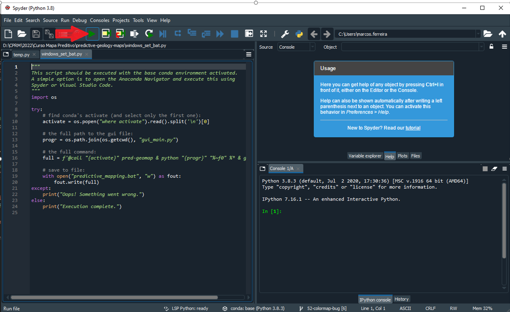

# predictive-geology-maps
Generate the predictive geology maps automatically to use in CPRM projects of anomaly charts. The methodology implemented here was used to generate predictive maps in [central Amapá](https://rigeo.cprm.gov.br/handle/doc/22542), [SW Pará](https://rigeo.cprm.gov.br/handle/doc/22541), and [N Rondônia](https://rigeo.cprm.gov.br/handle/doc/22531).

# Getting started
### Using a terminal
Clone this repository to your local machine using your tool of choice. Open the [Anaconda Prompt](https://docs.anaconda.com/anaconda/user-guide/getting-started/) (requires a working [Anaconda](https://www.anaconda.com/) installation) and **navigate to the location of the cloned repository**. Then, install the [environment](environment.yml) using the command:  
`conda env create -f environment.yml`

Installing the `environment.yml` might take some time. 

Then, follow the instructions to activate the newly installed environment:  
`conda activate pred-geomap`

The terminal should look like this:  

Now you should be able to use the scripts. Don't forget to activate the `pred-geomap` environment whenever you want to run this code.  

Alternatively, you can run the [`windows_installer.py`](windows_installer.py) file using your base [Anaconda](https://www.anaconda.com/) described below. 

### Running a Python script
Clone this repository to your local machine using your tool of choice. Open the [Anaconda Navigator](https://docs.anaconda.com/anaconda/user-guide/getting-started/) (requires a working [Anaconda](https://www.anaconda.com/) installation) and launch one of the available IDEs (integrated development environment) Spyder or Visual Studio Code: 

Then, execute the  [windows_installer.py](windows_installer.py):  

In doing so, the script creates a new Anaconda environment with the information in the [environment](environment.yml) file and also creates a `.bat` file as specified in [windows_set_bat.py](windows_set_bat.py).

# Running the scripts
The [main program](main.py) accepts a [configuration file](config.ini) as input and performs all the computations based on such file. The [configuration file](config.ini) looks like this:  

You can run the main program using the [Anaconda Prompt](https://docs.anaconda.com/anaconda/user-guide/getting-started/) after activating the `pred-geomap` environment. The program expects the [configuration file](config.ini) to be named [config.ini](config.ini) and be located in the same directory as the [main](main.py) file. Calling `python main.py` should be enough to execute the program if everything (the [main program](main.py) and the [configuration file](config.ini)) is in the same folder.  

We also included a very simple user interface that can help you set up the [configuration file](config.ini). You can call it through `python gui_main.py`:  

## Windows users
You can create a `.bat` file to execute the program with a double-click using [windows_set_bat.py](windows_set_bat.py). After installing the [environment](environment.yml) use the command:  

`python windows_set_bat.py`  

This will create a file named `predictive_mapping.bat` that can be dragged to other folders and executed with a double click. The `.bat` file simply ensures the full paths are used when calling [gui_main.py](gui_main.py). 

*******************************************************************************************************************  

*Software here is distributed on an "AS IS" BASIS, WITHOUT WARRANTIES OR CONDITIONS OF ANY KIND, either express or implied.*
