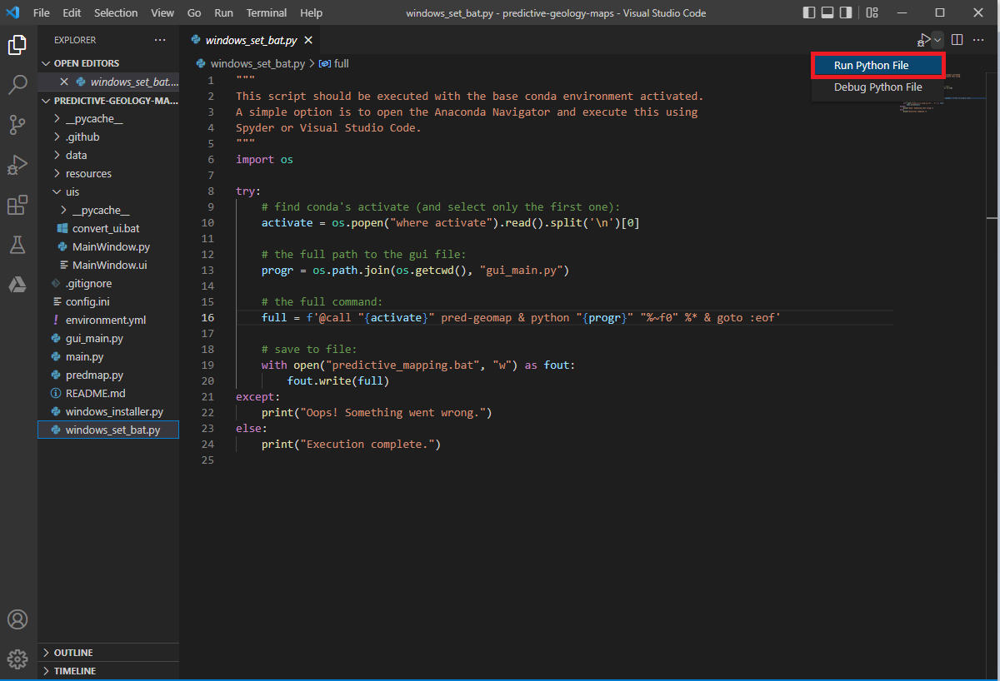

# predictive-geology-maps
Generate the predictive geology maps automatically to use in CPRM projects of anomaly charts. The methodology implemented here was used to generate predictive maps in [central Amapá](https://rigeo.cprm.gov.br/handle/doc/22542), [SW Pará](https://rigeo.cprm.gov.br/handle/doc/22541), and [N Rondônia](https://rigeo.cprm.gov.br/handle/doc/22531).


# Getting started
### Using a terminal
Clone this repository to your local machine using your tool of choice. Open the [Anaconda Prompt](https://docs.anaconda.com/anaconda/user-guide/getting-started/) (requires a working [Anaconda](https://www.anaconda.com/) installation):


  
Then, use the prompt to **navigate to the location of the cloned repository**. Install the [environment](environment.yml) using the command:  
`conda env create -f environment.yml`

Installing the `environment.yml` might take some time. 

Then, follow the instructions to activate the newly installed environment:  
`conda activate pred-geomap`

The terminal should look like this:  


Now you should be able to use the scripts. Don't forget to activate the `pred-geomap` environment whenever you want to run this code.  

Alternatively, you can run the [`windows_installer.py`](windows_installer.py) file using your base [Anaconda](https://www.anaconda.com/) described below. 

### Running a Python script
Clone this repository to your local machine using your tool of choice. Open the [Anaconda Navigator](https://docs.anaconda.com/anaconda/user-guide/getting-started/) (requires a working [Anaconda](https://www.anaconda.com/) installation):


Launch one of the available IDEs (integrated development environment, green arrows) Spyder or Visual Studio Code (make sure `base` is the active environment -red rectangle): 


Then, execute the  [windows_installer.py](windows_installer.py):  




In doing so, the script creates a new Anaconda environment with the information in the [environment](environment.yml) file and also creates a `.bat` file as specified in [windows_set_bat.py](windows_set_bat.py).

# Running the scripts
The [main program](main.py) accepts a [configuration file](config.ini) as input and performs all the computations based on such file. The [configuration file](config.ini) looks like this:  


You can run the main program using the [Anaconda Prompt](https://docs.anaconda.com/anaconda/user-guide/getting-started/) after activating the `pred-geomap` environment. The program expects the [configuration file](config.ini) to be named [config.ini](config.ini) and be located in the same directory as the [main](main.py) file. Calling `python main.py` should be enough to execute the program if everything (the [main program](main.py) and the [configuration file](config.ini)) is in the same folder.  

We also included a very simple user interface that can help you set up the [configuration file](config.ini). You can call it through `python gui_main.py`:  


## Windows users
You can create a `.bat` file to execute the program with a double-click using [windows_set_bat.py](windows_set_bat.py). After installing the [environment](environment.yml) use the command:  

`python windows_set_bat.py`  

This will create a file named `predictive_mapping.bat` that can be dragged to other folders and executed with a double click. The `.bat` file simply ensures the full paths are used when calling [gui_main.py](gui_main.py). 

## Reference
You can find more information in the [conference proceedings paper](https://library.seg.org/doi/10.1190/image2022-3750705.1). The bibtex entry is below:

```bibtex
@inproceedings{a_step_2022,
	address = {Houston, Texas},
	title = {A step towards the automatization of predictive geological mapping},
	url = {https://library.seg.org/doi/abs/10.1190/image2022-3750705.1},
	doi = {10.1190/image2022-3750705.1},
	abstract = {Standardized geological mapping is paramount for understanding available resources, developing a long-term plan of land use and management, and can lead to new ore discoveries. These are some of the reasons that explain why geological mapping is important for multiple stakeholders, including the public and private sectors. Traditional geological mapping includes several field campaigns necessary to acquire samples that are analyzed during the mapping process. Ideally, the sampling of such campaigns would follow a regularly spaced grid. However, time, budget, and access constraints make it difficult to have regularly sampled regions, and geologic mappers frequently make use of other regional data to aid their interpretation. Superficial geology has a high correlation with geophysical methods, such as airborne-acquired magnetic and gamma-ray spectrometer surveys, as well as orbital remote sensing data. These data are readily and largely available for many regions around the globe and the current rise in the application of machine-learning techniques can help in the acceleration of their interpretation and analysis. Furthermore, the automatization of such analysis has the potential to guide geoscientists to areas that need a thorough investigation, leading to more reliable mapping. We document the steps that are being developed for the automatization of predictive geological mapping using airborne geophysical and orbital remote sensing data, as well as the current limitations and opportunities for enhancement. Our objective is to facilitate widespread access to machine learning techniques for predictive mapping for a larger community of geological mappers. The code we discuss here can be accessed at https://github.com/marcosbr/predictive-geology-maps and so far has been used to generate over 40 predictive geologic maps at 1:100,000 scale.},
	booktitle = {Second International Meeting for Applied Geoscience and Energy},
	publisher = {Society of Exploration Geophysicists},
	author = {Pires de Lima, Rafael and Ferreira, Marcos and Costa, Iago},
	year = {2022},
	doi = {10.1190/image2022-3750705.1},
	pages = {1437--1441},
}
```

*******************************************************************************************************************  

*Software here is distributed on an "AS IS" BASIS, WITHOUT WARRANTIES OR CONDITIONS OF ANY KIND, either express or implied.*
